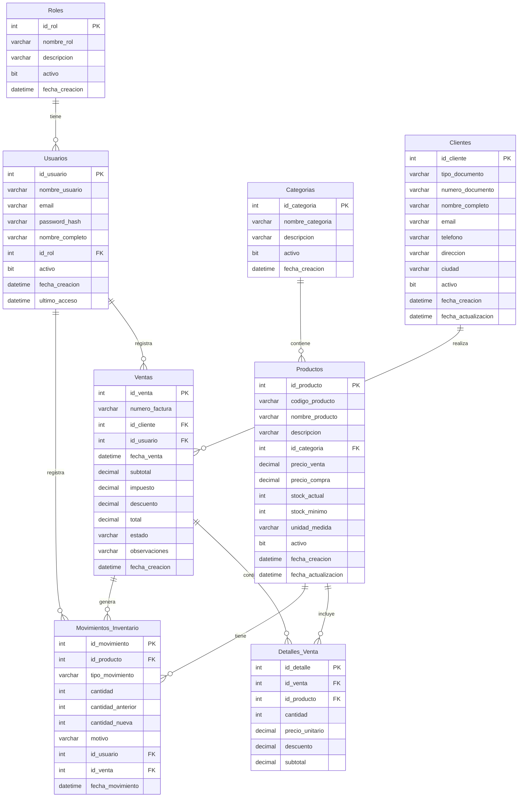

# Diagrama Entidad-Relación - OmniStock (Mermaid)

Este diagrama puede visualizarse en cualquier editor que soporte Mermaid (GitHub, GitLab, VS Code con extensión, etc.)

## Cómo Visualizar

1. **GitHub/GitLab**: Copia el código Mermaid y pégalo en un archivo `.md`
2. **VS Code**: Instala la extensión "Markdown Preview Mermaid Support"
3. **Online**: Usa [Mermaid Live Editor](https://mermaid.live/)
